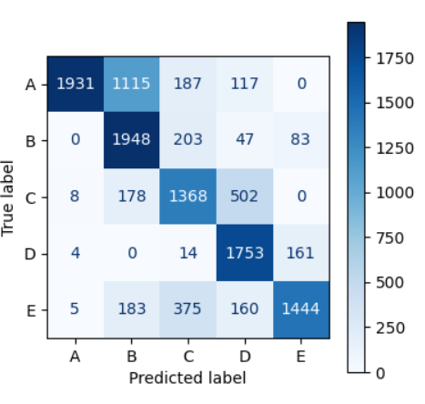

# Classification of the Weight Lifting Exercises Dataset [1]

A simple approach for classifying an exercise as correctly or incorrectly performed (4 different possible incorrect ways) given accelerometer, gyro and magnetometer sensor data out of 4 sensors.


Final performance of a tree-based classifier on an un-seen test set:



```
[1] Velloso, E.; Bulling, A.; Gellersen, H.; Ugulino, W.; Fuks, H. Qualitative Activity Recognition of Weight Lifting Exercises. Proceedings of 4th International Conference in Cooperation with SIGCHI (Augmented Human '13) . Stuttgart, Germany: ACM SIGCHI, 2013.

Read more: http://groupware.les.inf.puc-rio.br/har#weight_lifting_exercises#ixzz6fu0nZfIX
```